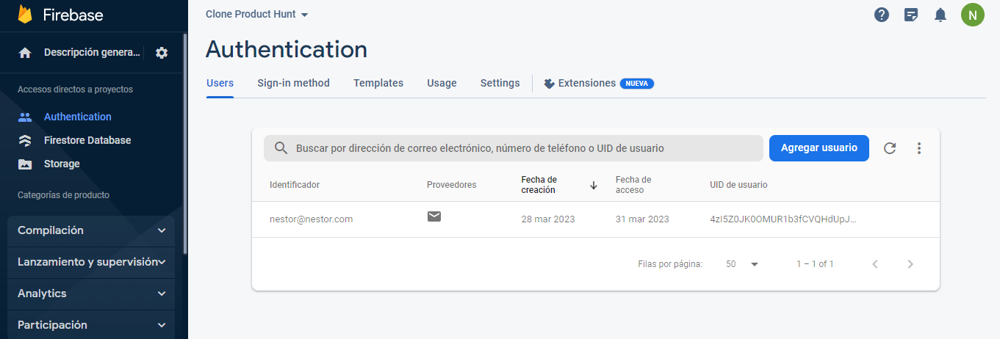
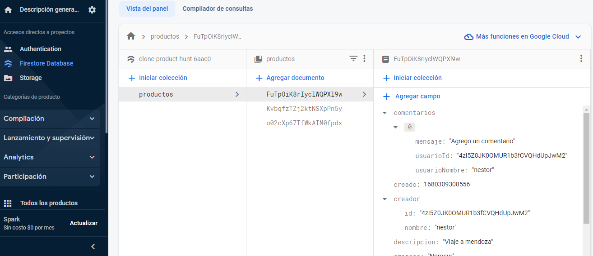
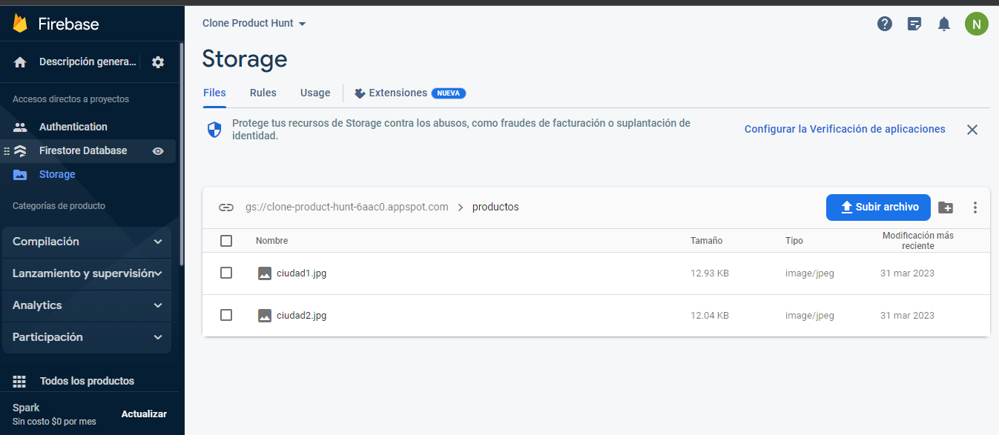

App para cargar publicaciones y que puedan recibir comentarios, realizado con [nextjs](https://nextjs.org/) y Firebase

Deploy del sitio: [CLONE-PRODUCT-HUNT](https://tangerine-cobbler-88e3c3.netlify.app/)

Si no tengo una sesion iniciada:

- No puedo cargar productos.
- No puedo votar.
- No puedo escribir comentarios.

Dependecias utilizadas:[firebase](https://console.firebase.google.com/).

- Firebase authentication con correo electronico.
- Firebase Database para almacenar los posteos y comentarios.
- Firebase Storage para almacenar las imagenes.
- Babel

